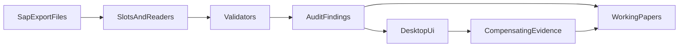

# אפיון כללי — כלי ITGC SAP HANA APP

**גרסת מסמך:** 1.0  
**קהל יעד:** מבקרים, מנהלי פרויקט ומפתחים חדשים  
**היקף:** אפיון מוצר ותהליך (לא מדריך התקנה מפורט — ראו `README.md`)

---

## 1. מטרה והיקף

הכלי הוא אפליקציית **Desktop** לתמיכה בביקורת **ITGC** (Information Technology General Controls) בסביבת **SAP HANA APP**. מטרתו לאפשר קליטת **קבצי יצוא** מ־SAP, בדיקת תקינות מבנית, הרצת בקרות אוטומטיות, הפקת ממצאים וניירות עבודה, ותמיכה בתהליכי סקירה (משתמשים / הרשאות) מול גורמים טכניים ועסקיים.

### בתוך ההיקף

- קליטת קבצים בפורמטים `.txt`, `.csv`, `.xlsx`, `.xlsm` לפי פרופילי יצוא (slots).
- הפרדה בין שגיאות **intake** (מבנה / עמודות חובה) לבין **audit findings** (ממצאי בקרה עם מזהה בקרה).
- ניתוח בקרות בתחומי **MA** (ניהול גישה) ו־**MC** (ניהול שינויים).
- ייצוא דוחות ממצאים, ניירות עבודה (Working Papers), תיעוד **IPE**, ותיעוד **בקרות מפצות**.
- סקירת דוח משתמשים וייצוא/ייבוא; טיוטות מייל ב־Outlook (Windows).

### מחוץ להיקף

- **אין חיבור SQL חי** ל־HANA — הכלי עובד על קבצי יצוא בלבד.
- אין שינוי נתונים או זהויות בתוך SAP (קריאה־בלבד על היצואים).
- דומיין **MO** (ניהול תפעולי) מוצג בממשק כ־"בפיתוח" ואינו מריץ בקרות פעילות.
- אין שרת מרכזי / סנכרון רב־משתמשים — מצב העבודה נשמר מקומית.
- הכלי אינו מחליף מערכת GRC מלאה או continuous monitoring.

---

## 2. משתמשים ותרחיש שימוש עיקרי

**משתמש עיקרי:** מבקר IT / אנליסט ביקורת המבצע סקירת ITGC על SAP APP.

**זרימת עבודה מומלצת מקצה לקצה:**

1. **הגדרות מערכת** — תקופת סקירה, סביבת עבודה, רשימות מורשים (STMS, super users, מפתחים), מדיניות סיסמאות, מיפוי IPE↔בקרות, מיפוי אימיילים.
2. **רשימת בקרות לניתוח** — סימון בקרות `in_scope`, עדכון תיאורים / רמת סיכון / אחראים.
3. **קליטת קבצים** — שיבוץ קבצי יצוא ל־slots (למשל `USR02`, `AGR_1251`, `RSPARAM`, `E070`); צירוף ראיות IPE לפי הצורך.
4. **ביצוע ניתוח** — הרצת הבדיקות; עיון בסיכום ובפירוט ממצאים; ייצוא `audit_findings_*.xlsx` ונייר עבודה לבקרה.
5. **סקירת משתמשים / הרשאות** — השלמת סטטוסים והערות; ייצוא/ייבוא; שליחת טיוטות למייל.
6. **בקרות מפצות** — צירוף קובץ תיעוד לבקרה עם ליקוי; התיעוד נכנס לגיליון "בקרה מפצה" בייצוא Working Paper הבא.

---

## 3. מודולריות פונקציונלית (ממשק)

הממשק ב־PySide6, בעברית ובכיוון **RTL**, ומאורגן בלשוניות:

| לשונית | תפקיד |
|--------|--------|
| רשימת בקרות לניתוח | עריכת קטלוג הבקרות (סקופ, תיאור, סיכון, אחראים); ייצוא/ייבוא Excel |
| הגדרות מערכת לביקורת | פרמטרי ביקורת, סביבה, מיפויי IPE ואימיילים |
| קליטת קבצים | שיבוץ קבצים ל־slots לפי דומיין/תת־קטגוריה; לוג קליטה; ראיות IPE |
| סקירת דוח משתמשים | טבלת preview (מבוססת `USR02` והעשרה), סטטוס סקירה, ייצוא/ייבוא, Outlook |
| סקירת הרשאות | תת־לשוניות לפי נושאי הרשאה (פרופילים חזקים, SU01/PFCG, DEBUG, Jobs וכו') |
| ביצוע ניתוח לביקורת | הרצת ניתוח, סיכום/פירוט ממצאים, ייצוא ממצאים ונייר עבודה, שליחת מייל |
| בקרות מפצות | רשימת בקרות עם ליקויים; העלאת קובץ תיעוד אחד לכל בקרה |

---

## 4. דומיינים ובקרות

| דומיין | סטטוס | דוגמאות לנושאים |
|--------|--------|------------------|
| **MA** — ניהול גישה | פעיל | סיסמאות, משתמשי־על, פרופילים חזקים, סקירת משתמשים/הרשאות, Joiners |
| **MC** — ניהול שינויים | פעיל | Import מורשים ב־STMS, SoD מפתחים בייצור |
| **MO** — ניהול תפעולי | בפיתוח | מוצג בממשק; ללא בקרות פעילות |

בקטלוג (`data/knowledge_base/controls_catalog.json`) מוגדרות כ־**16 בקרות** הניתנות לעריכת מטא־דאטה בממשק. לוגיקת הבדיקה מרוכזת ב־`AUDIT_CONTROL_DEFINITIONS` ב־`src/validators/spec_rules.py`. בעת אתחול, הקטלוג ממוזג להגדרות (למשל `in_scope`, תיאור, owners).

**עיקרון מיפוי:** `slot_key` = שם פרופיל היצוא = `source_name_override` ב־pipeline (למשל `USR02`, `AGR_1251`).

**Slots עיקריים:** `USR02`, `ADR6_USR21`, `AGR_USERS`, `AGR_1251`, `AGR_1252`, `AGR_DEFINE`, `UST04`, `USH04`, `RSPARAM`, `TPFET`, `E070`, `T000`, `STMS`.

דוגמאות מזהי בקרה: `MA2-2_AYALON_6` (מדיניות סיסמאות), `MA3-3_AYALON_14` (פרופילים חזקים), `MA1-1&MA7-17_AYALON_2` (השלמת סקירת משתמשים), `MC7-25_AYALON_44` (STMS Import מורשים).

---

## 5. ארכיטקטורה לוגית



| שכבה | מיקום עיקרי | תפקיד |
|------|-------------|--------|
| כניסה | `src/main.py` | UI (`python -m src.main`) או CLI |
| Pipeline | `src/pipeline.py` | אורקסטרציה: קריאה → ולידציה → דוח intake |
| Readers | `src/readers/` | קריאת TXT/CSV/XLSX ופורמטי transport |
| Validators | `src/validators/` | כללי intake + בקרות audit |
| Services | `src/services/` | ממצאים, סקירת משתמשים, בקרות מפצות |
| Reporting | `src/reporting/` | Excel ממצאים, Working Papers, הטמעת OLE |
| Persistence | `src/persistence/` | state, קטלוג, IPE, קבצי מפצה |
| UI | `src/ui/desktop_app.py` | ממשק Desktop RTL |

**הפרדה חובה:** שגיאות קליטה/מבנה (**intake**) אינן מוצגות כממצאי בקרה; ממצאי ביקורת נושאים `control_id` ומטופלים בנתיב audit / Working Paper.

לקבצים גדולים (במיוחד `AGR_1251`) נעשה שימוש בעיבוד במנות ובדגימה / הגבלת אוכלוסיה בנייר העבודה, כולל מיזוג מול `AGR_USERS` לבקרות הרשאה.

---

## 6. פלטים ונתונים

| פלט / נתיב | שימוש |
|------------|--------|
| `data/output/audit_findings_*.xlsx` | דוח ממצאים (סיכום + פירוט) |
| `data/output/working_papers/` (או נתיב ייצוא שנבחר) | נייר עבודה לבקרה — פרטי בקרה, אוכלוסיה, ממצאים, IPE, ובקרה מפצה |
| `data/output/` (JSON state) | הגדרות מערכת, מצב סקירה, מטא־דאטה IPE / בקרות מפצות ועוד |
| `data/evidence/<slot>/` | צילומי מסך IPE |
| `data/compensating_controls/<control_id>/` | קובץ תיעוד מפצה (אחד לבקרה; החלפה בעת העלאה מחדש) |
| `data/knowledge_base/controls_catalog.json` | קטלוג בקרות לעריכה (בגרסת המערכת) |

**Working Paper:** ליבקרה נבחרת; תמונות IPE מוטמעות כתמונות; קבצים שאינם תמונה (למשל PDF/ZIP) מוטמעים כ־OLE ב־Windows עם Excel. **בקרה מפצה:** רק אם הועלה תיעוד — נוסף גיליון ייעודי בייצוא הבא.

---

## 7. דרישות סביבה והנחות

- **Python** ≥ 3.10; תלויות ב־`requirements.txt` (בין היתר PySide6, openpyxl, Pillow; ב־Windows גם pywin32).
- **Windows מומלץ** ליכולות Outlook COM ולהטמעת OLE בנייר העבודה.
- הרשאות כתיבה ל־`data/output/`, `data/evidence/`, `data/compensating_controls/`.
- הפעלה: `python -m src.main` (מתוך סביבה וירטואלית מומלצת — פירוט ב־`README.md`).
- הנחה תפעולית: קבצי היצוא תואמים לפרופיל ה־slot שנבחר; סביבת העבודה והפרמטרים בהגדרות משפיעים על תוצאות הבדיקות.

---

## 8. גבולות והמשך פיתוח

| נושא | מצב |
|------|-----|
| דומיין MO | בפיתוח — ללא בקרות פעילות |
| חיבור DB ישיר ל־HANA | מחוץ להיקף הנוכחי (ייצואים בלבד) |
| אחסון מצב | מקומי בקבצי JSON — ללא שיתוף מרכזי |
| היקף בקרות | כ־16 בקרות בקטלוג; הרחבה דרך קטלוג + הגדרות validators |
| תפעול רב־משתמש / GRC מלא | לא בטווח המוצר הנוכחי |

---

## נספח — הפעלת הכלי (תמצית)

```text
python -m venv .venv
.venv\Scripts\activate
pip install -r requirements.txt
python -m src.main
```

לפירוט התקנה, CLI ופתרון תקלות — ראו את קובץ `README.md` בשורש הפרויקט.
